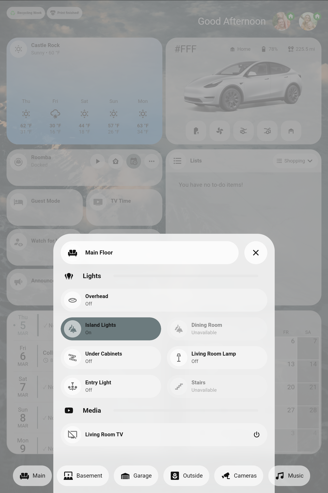
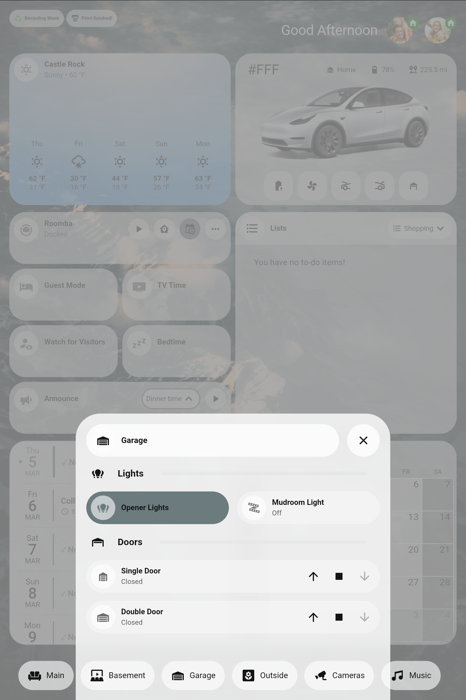
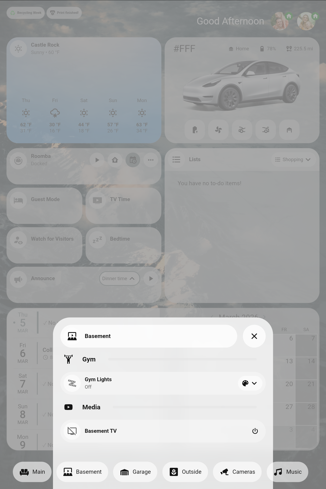
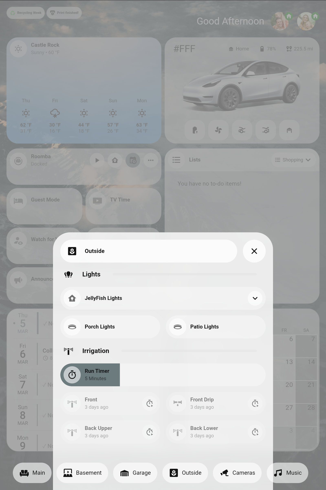
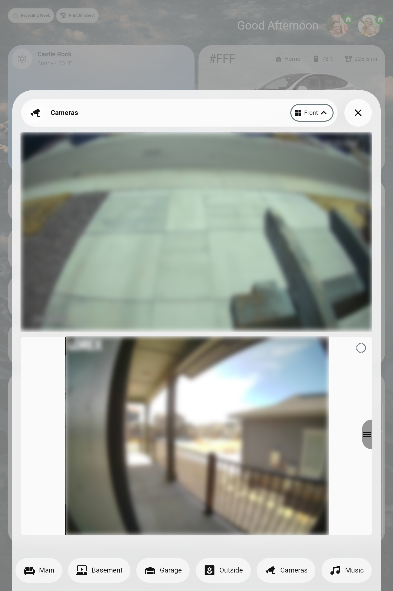
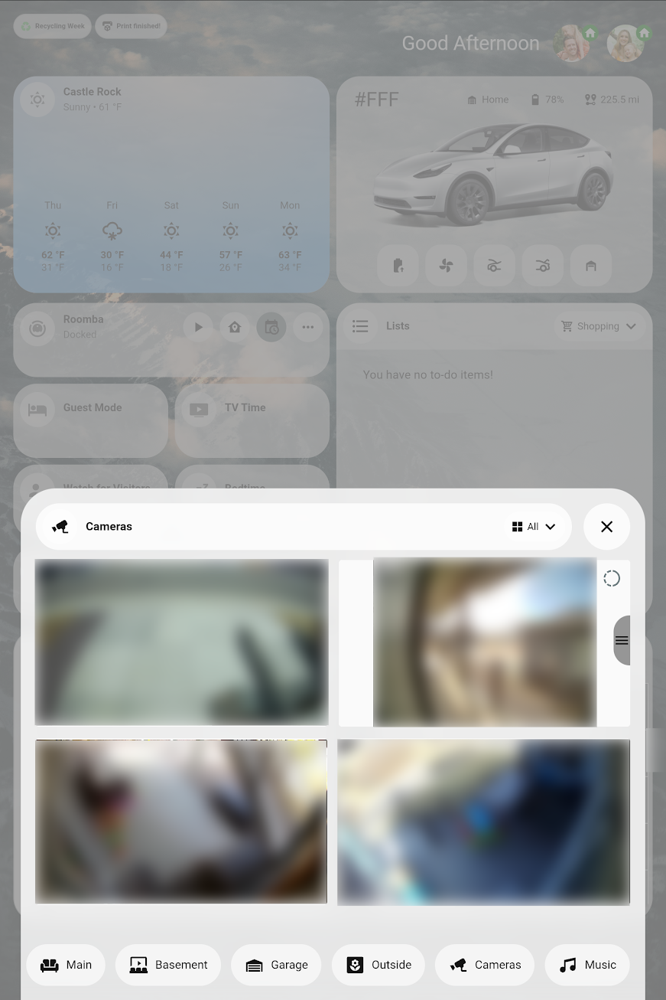
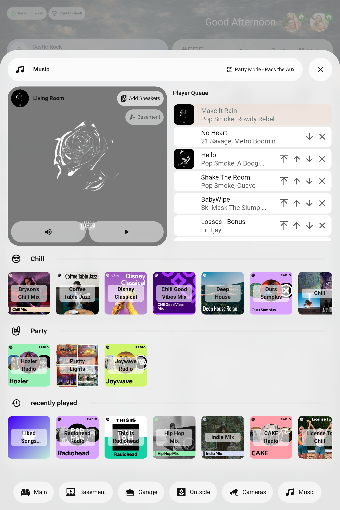
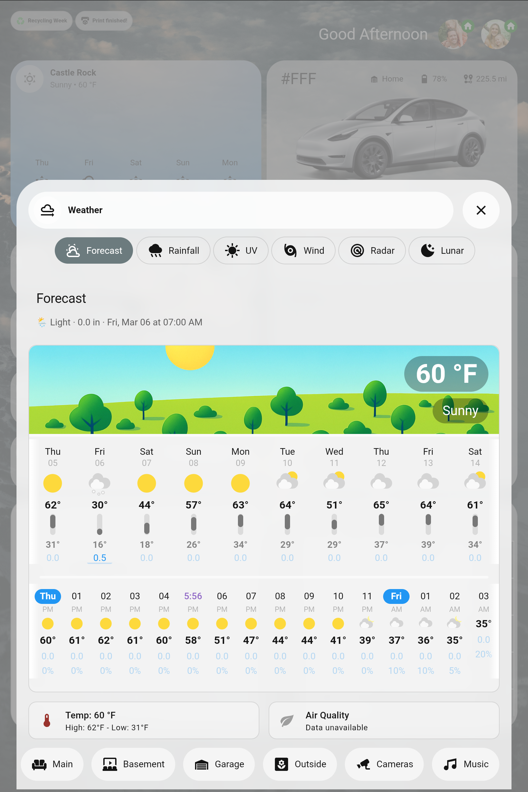
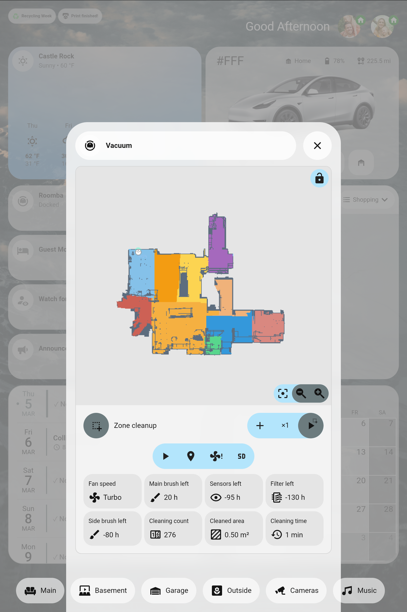
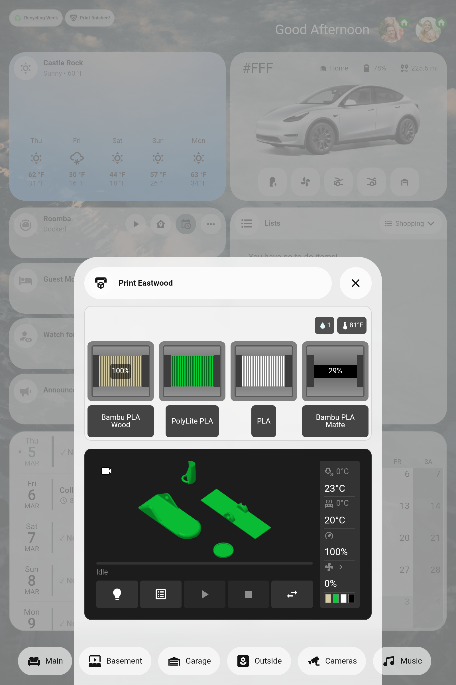

# Kitchen Dashboard for Home Assistant

A beautiful, feature-rich wall-mounted tablet dashboard for Home Assistant, designed for **portrait (vertical) orientation** on a 10" tablet. Unlike most Home Assistant dashboards that target landscape orientation, this dashboard is specifically optimized for tablets mounted in portrait mode, making better use of vertical space for scrollable content and stacked cards.

This dashboard provides quick access to home controls, weather, calendars, media, cameras, and more through an elegant glass-morphism UI built primarily with Bubble Card and Streamline Card templates.


## Why Portrait Orientation?

Most Lovelace dashboards are designed for landscape tablets or desktop browsers. This dashboard takes a different approach:

- **Better for wall-mounted tablets**: Portrait orientation feels more natural for a control panel mounted at eye level
- **More vertical space**: Allows for scrollable lists, stacked cards, and pop-ups that don't feel cramped
- **Optimized touch targets**: Buttons and controls are sized for comfortable one-handed interaction
- **Efficient information density**: The 6-column grid adapts well to portrait aspect ratios

## Table of Contents

- [Features](#features)
- [Screenshots](#screenshots)
- [Prerequisites](#prerequisites)
- [Installation](#installation)
- [Configuration](#configuration)
- [Dashboard Sections](#dashboard-sections)
  - [Header](#header)
  - [Weather Card](#weather-card)
  - [Vehicle Card (Tesla)](#vehicle-card-tesla)
  - [Quick Actions](#quick-actions)
  - [To-Do Lists](#to-do-lists)
  - [Calendar](#calendar)
  - [Footer Navigation](#footer-navigation)
- [Pop-up Rooms](#pop-up-rooms)
  - [Main Floor](#main-floor-popup)
  - [Garage](#garage-popup)
  - [Basement](#basement-popup)
  - [Outside](#outside-popup)
  - [Cameras](#cameras-popup)
  - [Music](#music-popup)
  - [Weather Panel](#weather-panel-popup)
  - [Vacuum](#vacuum-popup)
  - [3D Printer](#3d-printer-popup)
- [Helper Entities](#helper-entities)
- [Scripts](#scripts)
- [Template Sensors](#template-sensors)
- [Customization](#customization)
- [Troubleshooting](#troubleshooting)
- [Credits](#credits)

---

## Features

- **Portrait-First Design**: Specifically optimized for vertical tablet orientation
- **Glass-morphism Design**: Semi-transparent cards with blur effects for a modern aesthetic
- **Responsive 6-Column Grid Layout**: Optimized for wall-mounted tablets
- **Dynamic Header**: Time-based greetings, person presence indicators with location badges, and contextual notification chips
- **Weather Integration**: 5-day forecast with detailed weather panel including UV, wind, rainfall charts, and radar
- **Vehicle Integration**: Tesla status card with battery, range, climate, trunk/frunk controls
- **To-Do Lists**: Switchable lists (Shopping, Costco, Kids, Honey-Do) synced with Google Keep
- **Calendar**: Interactive calendar with event list and date selection
- **Media Control**: Music Assistant integration with multi-room audio grouping and playlist tiles
- **Camera Views**: Frigate camera streams with switchable front/back/all views
- **Room Pop-ups**: Quick access to room-specific controls via bottom navigation
- **Smart Notifications**: Contextual chips for garage doors, 3D printer status, recycling week, etc.

---

## Screenshots

### Main Dashboard
The home view displays weather, vehicle status, quick actions, to-do lists, and calendar in a clean grid layout.


### Room Pop-ups

<table>
<tr>
<td width="33%">

**Main Floor**
Light controls and media player for the main living area.



</td>
<td width="33%">

**Garage**
Garage door controls and lighting.



</td>
<td width="33%">

**Basement**
Gym lights and basement media player.



</td>
</tr>
<tr>
<td width="33%">

**Outside**
Outdoor lighting and irrigation controls.



</td>
<td width="33%">

**Cameras (Front View)**
Live camera feeds with view switching.



</td>
<td width="33%">

**Cameras (All Views)**
2x2 grid of all camera feeds.



</td>
</tr>
</table>

### Additional Features

<table>
<tr>
<td width="33%">

**Music Control**
Multi-room audio with playlist tiles.



</td>
<td width="33%">

**Weather Panel**
Detailed weather with charts and radar.



</td>
<td width="33%">

**Vacuum Control**
Interactive room selection map.



</td>
</tr>
<tr>
<td width="33%">

**3D Printer**
Bambu Lab printer status and AMS.



</td>
<td width="33%">
</td>
<td width="33%">
</td>
</tr>
</table>

---

## Prerequisites

### Required Integrations

- **Weather**: Any weather integration (e.g., `weather.home`, Google Weather, Pirate Weather, Met.no)
- **Calendar**: Google Calendar or other calendar integration
- **Person Tracking**: Mobile app or other presence detection

### Optional Integrations

- **Tesla**: Tesla Custom Integration (HACS)
- **Frigate**: Frigate NVR integration
- **Music Assistant**: For multi-room audio
- **Roborock/Vacuum**: For vacuum controls
- **Bambu Lab**: For 3D printer status
- **Google Keep**: For to-do list sync
- **RainBird**: For irrigation controls
- **JellyFish Lighting**: For outdoor lighting effects
- **Fully Kiosk Browser**: For tablet management

### Required Custom Cards (via HACS)

| Card | Description |
|------|-------------|
| [Bubble Card](https://github.com/Clooos/Bubble-Card) | Primary UI framework for buttons, pop-ups, media players |
| [Streamline Card](https://github.com/brunosabot/streamline-card) | Template system for reusable card configurations |
| [Card Mod](https://github.com/thomasloven/lovelace-card-mod) | CSS styling for cards |
| [Layout Card](https://github.com/thomasloven/lovelace-layout-card) | Grid layout system |
| [Button Card](https://github.com/custom-cards/button-card) | Advanced button templating |
| [Mushroom Cards](https://github.com/piitaya/lovelace-mushroom) | Title cards, chips, template cards |
| [Stack In Card](https://github.com/custom-cards/stack-in-card) | Combine cards without borders |
| [Config Template Card](https://github.com/iantrich/config-template-card) | Dynamic configuration |

### Additional Custom Cards (based on features used)

| Card | Used For |
|------|----------|
| [Frigate Card](https://github.com/dermotduffy/frigate-hass-card) | Camera streams |
| [Calendar Card Pro](https://github.com/FamousWolf/calendar-card-pro) | Calendar event list |
| [Atomic Calendar Revive](https://github.com/totaldebug/atomic-calendar-revive) | Calendar widget |
| [Calendar Click Wrapper](https://github.com/custom-cards/calendar-click-wrapper) | Interactive calendar |
| [ApexCharts Card](https://github.com/RomRider/apexcharts-card) | Weather charts |
| [Weather Forecast Extended](https://github.com/custom-cards/weather-forecast-extended-card) | Detailed forecast |
| [Lunar Phase Card](https://github.com/ngocjohn/lunar-phase-card) | Moon phase display |
| [Simple Tabs](https://github.com/nicufarmache/lovelace-simple-tabs) | Tabbed weather panel |
| [Xiaomi Vacuum Map Card](https://github.com/PiotrMachowski/lovelace-xiaomi-vacuum-map-card) | Vacuum room selection |
| [ha-bambulab-cards](https://github.com/greghesp/ha-bambulab-cards) | 3D printer status |
| [Mass Card](https://github.com/music-assistant/frontend) | Music Assistant queue |

---

## Installation

### 1. Install Custom Cards

Install all required custom cards via HACS. Search for each card and click "Download".

### 2. Copy Dashboard Files

Copy the following files to your Home Assistant config directory:

```
config/
├── kitchen-dashboard.yaml          # Main dashboard (from dashboard/)
├── kitchen-dashboard-header.yaml   # Header include
├── kitchen-dashboard-footer.yaml   # Footer include
└── www/
    └── community/
        └── streamline-card/
            └── streamline_templates.yaml  # From templates/
```

### 3. Add Background Image

Place your background image in the `www/` folder:

```
config/www/colin-lloyd-ex_1v95zFHg-unsplash.jpg
```

Or update the `background:` line in `kitchen-dashboard.yaml` to point to your image.

### 4. Configure configuration.yaml

Add the dashboard configuration:

```yaml
lovelace:
  mode: storage
  dashboards:
    kitchen-dashboard:
      mode: yaml
      title: Kitchen Dashboard
      icon: mdi:countertop-outline
      show_in_sidebar: true
      filename: kitchen-dashboard.yaml

frontend:
  extra_module_url:
    - /hacsfiles/lovelace-card-mod/card-mod.js
  themes:
    kitchen-dashboard:
      bubble-main-background-color: "rgb(245,245,245,.7)"
      ha-card-background: "rgb(245,245,245,.7)"
      bubble-secondary-background-color: "rgb(255,255,255,.6)"
      bubble-accent-color: "#6c7b7e"
      bubble-pop-up-main-background-color: "rgba(255,255,255,0.8)"
      primary-color: "#6c7b7e"
      accent-color: "#f8c8a7"
      ha-font-family-body: '"Quicksand", sans-serif'
      ha-font-family-heading: '"Quicksand", sans-serif'
      primary-font-family: '"Quicksand", sans-serif'
```

### 5. Create Helper Entities

Add the helper entities from `helpers/input_helpers.yaml` to your configuration. You can either:

- Add them directly to `configuration.yaml`
- Create them via the UI (Settings > Devices & Services > Helpers)
- Use a packages folder

### 6. Add Scripts

Copy scripts from `scripts/dashboard_scripts.yaml` to your `scripts.yaml` file.

### 7. Add Template Sensors

Copy template sensors from `templates/template_sensors.yaml` to your `templates.yaml` file.

### 8. Restart Home Assistant

Restart Home Assistant to load all changes, then navigate to your new dashboard.

---

## Configuration

### Customizing Entity IDs

The dashboard references specific entity IDs that you'll need to update for your setup:

| Entity Type | Example | Location |
|-------------|---------|----------|
| Weather | `weather.home` | Multiple cards |
| Persons | `person.person_1`, `person.person_2` | Header |
| Vacuum | `vacuum.roborock_q5_max` | Quick actions, Vacuum popup |
| Calendars | `calendar.family`, `calendar.birthdays_2` | Calendar card |
| Todo Lists | `todo.google_keep_shopping_list` | To-do lists |
| Media Players | `media_player.ma_living_room_receiver` | Music popup |
| Cameras | `camera.driveway_cam`, `camera.doorbell_cam` | Cameras popup |
| Garage Doors | `cover.garage_single_door`, `cover.garage_double_door` | Garage popup |
| Tesla | `sensor.fff_battery_level`, etc. | Tesla card |
| Lights | Various `light.*` entities | Room popups |

Search and replace entity IDs throughout the YAML files to match your setup.

### Theme Customization

The theme uses a muted slate/teal (`#6c7b7e`) as the primary color and soft peach (`#f8c8a7`) as the accent. Modify these in the theme section:

```yaml
primary-color: "#6c7b7e"     # Change to your preferred primary
accent-color: "#f8c8a7"      # Change to your preferred accent
```

### Font

The dashboard uses the Quicksand font. To use it, either:

1. Add the font via Google Fonts in your HA frontend
2. Change the font family in the theme to a system font

---

## Dashboard Sections

### Header

The header spans the full width and contains:

**Left Side - Notification Chips:**
- **Recycling Week**: Shows when recycling pickup is scheduled
- **3D Printer Progress**: Shows remaining print time with tap to open printer popup
- **Print Complete**: Notification when a print finishes
- **Scene Schedule**: Shows currently active scheduled scene
- **Furnace Filter**: Reminder to change filters (tap to dismiss)
- **Garage Open**: Warning when garage door is open

**Right Side - Greeting and Presence:**
- Dynamic greeting based on time of day
- Person avatars with location indicator badges (home=green, work=blue, away=orange)

### Weather Card


Uses Bubble Card's weather module to display:
- Current temperature and conditions
- Location name
- 5-day forecast
- Tap to open detailed weather panel popup

**Template:** `bubble-weather` in streamline_templates.yaml

### Vehicle Card (Tesla)

Displays Tesla vehicle status with:
- Vehicle name and image background
- Location tracker
- Battery level with charging indicator badge
- Estimated range
- Charge limit slider
- Climate, frunk, trunk controls
- Quick garage door access

**Template:** `tesla-card` in streamline_templates.yaml

### Quick Actions

A vertical stack of commonly-used controls:

1. **Vacuum Control**
   - Entity state display
   - Start/Pause button (icon changes based on state)
   - Return to dock
   - Toggle vacuum schedule
   - Open vacuum map popup

2. **Mode Toggles**
   - Guest Mode toggle
   - TV Time scene activation

3. **Monitoring**
   - Watch for Visitors toggle
   - Bedtime scene activation

4. **Announcements**
   - Dropdown to select announcement type
   - Play button to trigger TTS announcement

### To-Do Lists

Interactive to-do list card with:
- Dropdown selector (Shopping, Costco, Kids, Honey-Do)
- Syncs with Google Keep lists
- Check items as complete
- Swipe to delete

**Template:** `bubble-to-do-lists` in streamline_templates.yaml

**Required Helpers:**
- `input_select.kitchen_dashboard_selected_list`

### Calendar

Split view with:
- **Left**: Scrollable event list starting from selected date
- **Right**: Interactive calendar grid

Clicking a date on the calendar updates the event list. Uses:
- Calendar Card Pro for event list
- Calendar Click Wrapper + Atomic Calendar for the calendar widget

**Template:** `calendar-and-events-pro` in streamline_templates.yaml

**Required Helpers:**
- `input_text.kitchen_dashboard_selected_date`

### Footer Navigation

Bubble Card horizontal buttons stack providing quick access to room popups:
- Main Floor
- Basement
- Garage
- Outside
- Cameras
- Music

---

## Pop-up Rooms

Pop-ups are triggered by hash navigation (e.g., `#garage`). Each popup uses Bubble Card's pop-up card type.

### Main Floor Popup

**Hash:** `#main`


Controls for main living area:
- **Lights Section**
  - Overhead lights (slider)
  - Island lights (switch)
  - Dining room (slider)
  - Under cabinet lights (slider)
  - Living room lamp (slider)
  - Entry light (slider)
  - Stairs (slider)
- **Media Section**
  - Living room TV media player

### Garage Popup

**Hash:** `#garage`


- Garage opener lights (switch)
- Mudroom WLED light (slider)
- Single door cover controls
- Double door cover controls

### Basement Popup

**Hash:** `#basement`


- **Gym Section**
  - Gym WLED lights with preset selector
- **Media Section**
  - Basement TV media player

### Outside Popup

**Hash:** `#outside`


- **Lights Section**
  - JellyFish lighting with effect selector
  - Porch lights (slider)
  - Patio lights (slider)
- **Irrigation Section**
  - Run timer slider (1-30 minutes)
  - Zone buttons with timed irrigation triggers:
    - Front yard sprinkler
    - Front yard drip line
    - Back yard upper
    - Back yard lower

### Cameras Popup

**Hash:** `#cameras`


Multi-view camera display using Frigate cards:

**View Selector:** Dropdown to switch between:
- **Front**: Driveway + Doorbell cameras (stacked)
- **Back**: Patio + Basement cameras (stacked)
- **All**: 2x2 grid of all cameras


Each camera uses Frigate Card with:
- Live view mode
- Hidden menu/status bar for clean display
- 16:9 aspect ratio

**Required Helpers:**
- `input_select.kitchen_dashboard_camera_view`

### Music Popup

**Hash:** `#music`


Full-featured music control panel:

**Top Row (Side by Side):**
- **Left - Media Player**
  - Album art background
  - Playback controls
  - Speaker grouping with dynamic join/unjoin buttons

- **Right - Queue**
  - Music Assistant queue display
  - Scrollable track list

**Bottom - Playlist Sections:**
Horizontally scrollable playlist tiles organized by mood:
- **Chill**: Relaxing playlists
- **Party**: Upbeat playlists
- **Recently Played**: Dynamic from Music Assistant

Tapping a playlist tile plays it on the selected speaker.

**Template:** `playlist-tile`, `bubble-media-card` in streamline_templates.yaml

**Required Scripts:**
- `script.music_dashboard_play_media`
- `script.music_dashboard_toggle_group_player`

### Weather Panel Popup

**Hash:** `#weather-panel`


Tabbed detailed weather display:

**Tabs:**
1. **Forecast**
   - Extended forecast card
   - Temperature and AQI cards
   - Sunrise/sunset times

2. **Rainfall**
   - ApexCharts precipitation/temperature graph
   - 24-hour rainfall summary

3. **UV**
   - ApexCharts UV index/cloud coverage graph
   - UV safety recommendations

4. **Wind**
   - ApexCharts wind speed/direction graph
   - Wind condition summary

5. **Radar**
   - Embedded Windy.com radar iframe

6. **Lunar**
   - Moon phase card
   - Rise/set times
   - Next full moon

**Required Sensors:**
- `sensor.google_weather_hourly_forecasts_full_hourly_forecast`
- `sensor.next_rain_summary`
- `sensor.24h_rainfall_summary`
- `sensor.uv_and_cloud_summary`
- `sensor.wind_summary`
- `sensor.moon_summary`

### Vacuum Popup

**Hash:** `#vacuum`


Xiaomi Vacuum Map Card with:
- Interactive floor plan
- Room segment selection
- Zone cleaning
- Go-to-point mode
- Room labels and outlines

Requires Roborock/Xiaomi vacuum integration with map camera entity.

### 3D Printer Popup

**Hash:** `#3d-printer`


Bambu Lab printer status cards:
- AMS (filament) status
- Print progress
- WLED light control for print area

---

## Helper Entities

Create these helpers for dashboard functionality:

### Input Selects

```yaml
input_select:
  kitchen_dashboard_selected_list:
    options: [shopping, costco, kids, honey]
  kitchen_dashboard_camera_view:
    options: [front, back, all]
  kitchen_dashboard_media_player:
    options: [Living Room, Basement]
  announcement:
    options: [Dinner time, Bed time]
  vacuum_segments:
    options: [Kitchen, Living Room, Dining Room, ...]
```

### Input Booleans

```yaml
input_boolean:
  guest_mode:
  vacuum_enabled:
  watching_for_visitors:
  furnance_filter_reminder:
  kitchen_dashboard_print_complete_notification:
  is_recycling_pickup_next:
```

### Input Text

```yaml
input_text:
  kitchen_dashboard_selected_date:
```

### Input Number

```yaml
input_number:
  irrigation_run_minutes:
    min: 1
    max: 30
```

See `helpers/input_helpers.yaml` for complete configuration.

---

## Scripts

Key scripts for dashboard functionality:

| Script | Purpose |
|--------|---------|
| `start_pause_vacuum` | Toggle vacuum between cleaning/paused |
| `announce` | TTS announcement based on input_select |
| `run_irrigation` | Run irrigation zone for duration |
| `music_dashboard_play_media` | Play playlist on selected speaker |
| `music_dashboard_toggle_group_player` | Join/unjoin speakers |
| `hard_refresh_kitchen_dashboard` | Force refresh on tablet |
| `deactivate_scene` | Turn off all entities in a scene |

See `scripts/dashboard_scripts.yaml` for complete configurations.

---

## Template Sensors

Required template sensors:

| Sensor | Purpose |
|--------|---------|
| `sensor.google_weather_hourly_forecasts_*` | Weather chart data |
| `sensor.forecast_*` | Individual forecast values |
| `sensor.next_rain_summary` | Rain prediction text |
| `sensor.*_location_icon/color` | Person location badges |
| `sensor.music_dashboard_recently_played` | Recent playlists |

See `templates/template_sensors.yaml` for complete configurations.

---

## Customization

### Changing the Background

Update the first line of `kitchen-dashboard.yaml`:

```yaml
background: center / cover no-repeat url('/local/your-image.jpg')
```

### Adding/Removing Notification Chips

Edit `kitchen-dashboard-header.yaml` to add conditional chips:

```yaml
- type: conditional
  conditions:
    - condition: state
      entity: binary_sensor.your_sensor
      state: "on"
  chip:
    type: template
    icon: mdi:your-icon
    content: Your message
```

### Adding Room Popups

1. Add a new button to the footer navigation
2. Create a new vertical-stack with Bubble Card popup
3. Use hash navigation (e.g., `#newroom`)

### Modifying Card Heights

Most cards use explicit heights in the styles section:

```yaml
styles: |-
  .bubble-button-container { height: 89px !important; }
```

### Adapting for Landscape

While this dashboard is optimized for portrait orientation, you can adapt it for landscape by:
1. Reducing the number of grid columns from 6 to 4
2. Adjusting card heights
3. Reorganizing content to be more horizontal

---

## Troubleshooting

### Cards Not Loading

- Ensure all custom cards are installed via HACS
- Clear browser cache
- Check browser console for errors

### Theme Not Applying

- Verify theme is defined in configuration.yaml
- Select the theme in the dashboard settings
- Check for YAML syntax errors

### Pop-ups Not Opening

- Verify hash navigation is correct (e.g., `#garage`)
- Check that Bubble Card is properly installed
- Ensure pop-up card exists in the dashboard

### Template Errors

- Check that all required entities exist
- Verify sensor names match between templates and cards
- Use Developer Tools > Templates to test Jinja

### Vacuum Map Not Loading

- Ensure camera entity for map exists
- Check vacuum integration is working
- Verify calibration settings

---

## File Structure

```
kitchen-dashboard/
├── README.md
├── LICENSE
├── .gitignore
├── dashboard/
│   ├── kitchen-dashboard.yaml      # Main dashboard file
│   ├── kitchen-dashboard-header.yaml
│   └── kitchen-dashboard-footer.yaml
├── templates/
│   ├── streamline_templates.yaml   # Streamline Card templates
│   └── template_sensors.yaml       # Template sensors
├── scripts/
│   └── dashboard_scripts.yaml      # Required scripts
├── helpers/
│   └── input_helpers.yaml          # Input helper definitions
├── themes/
│   └── kitchen-dashboard-theme.yaml
├── examples/
│   └── configuration.yaml          # Example config
└── screenshots/
    ├── home.png
    ├── main-floor.png
    ├── garage.png
    ├── basement.png
    ├── outside.png
    ├── cameras-front-blurred.png
    ├── cameras-all-blurred.png
    ├── music.png
    ├── weather.png
    ├── vacuum.png
    └── 3d-printer.png
```

---

## Credits

- **Bubble Card** by [Clooos](https://github.com/Clooos/Bubble-Card) - Primary UI framework
- **Streamline Card** by [Bruno Sabot](https://github.com/brunosabot/streamline-card) - Template system
- **Card Mod** by [Thomas Lovn](https://github.com/thomasloven/lovelace-card-mod) - CSS customization
- Background images from [Unsplash](https://unsplash.com)
- Icon sets: Material Design Icons, m3of icons

---

## License

This project is provided under the MIT License. Feel free to modify and adapt for your own Home Assistant setup.

---

## Contributing

Found a bug or have an improvement? Feel free to open an issue or submit a pull request!
